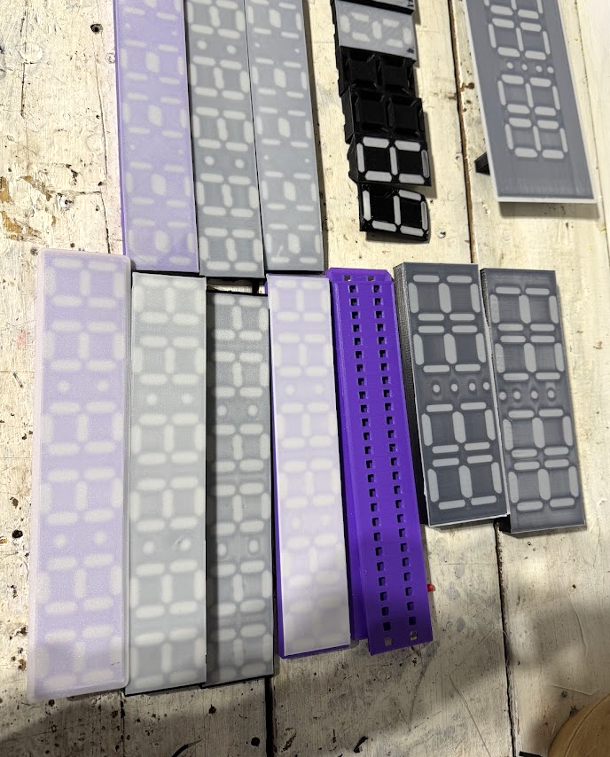
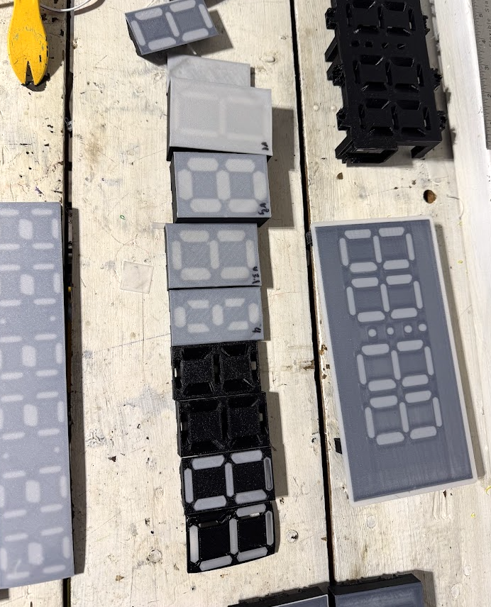
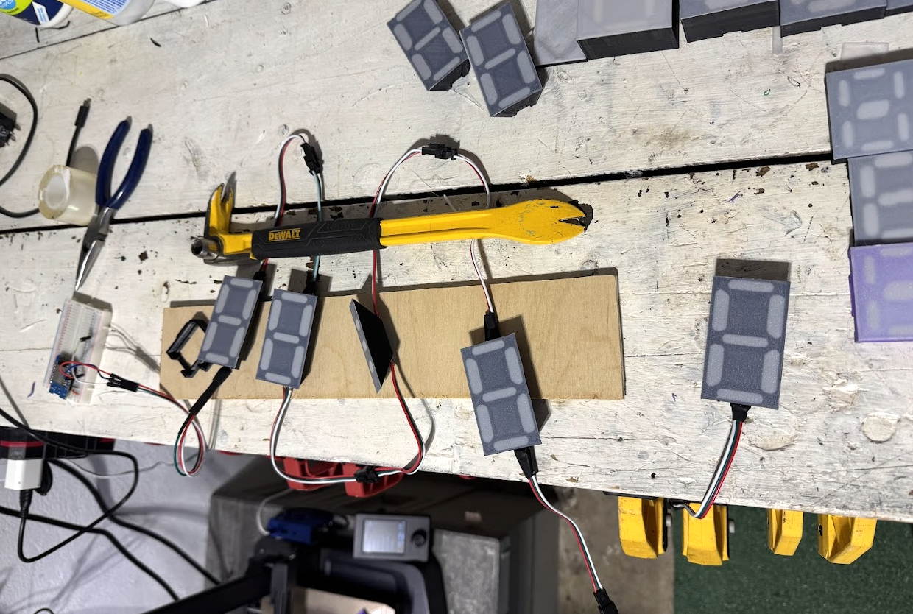
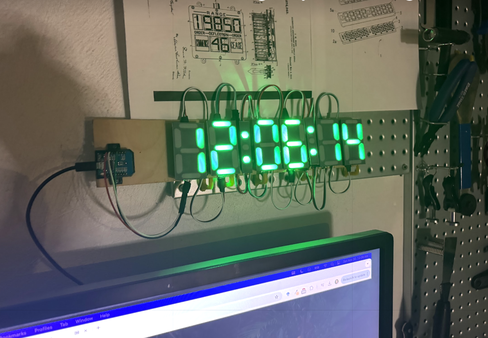
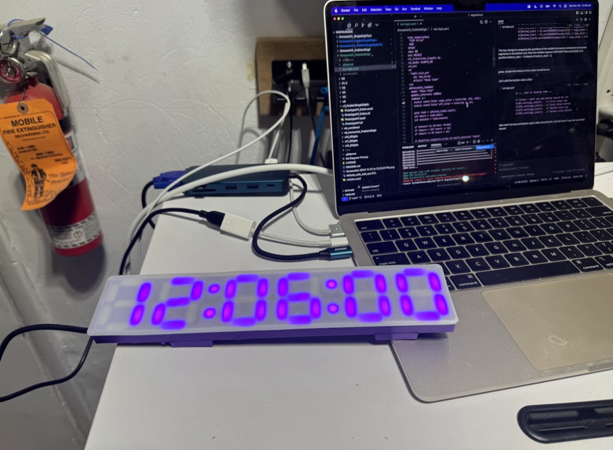
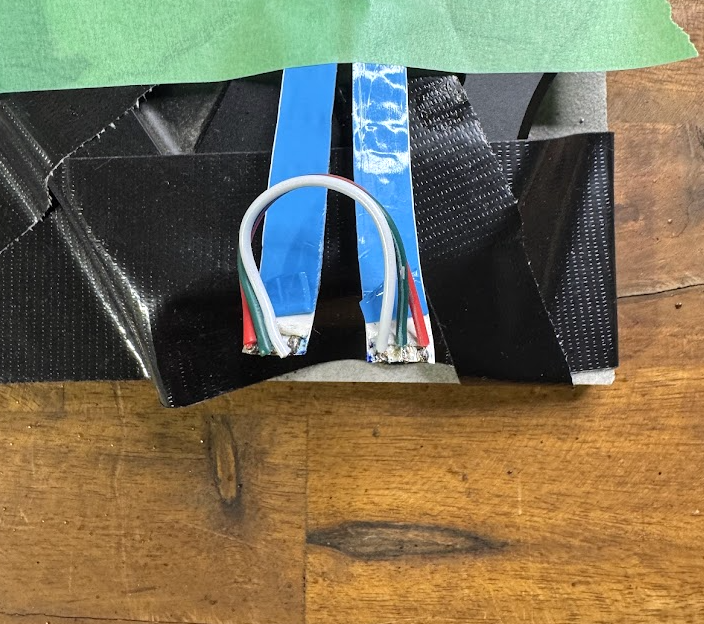
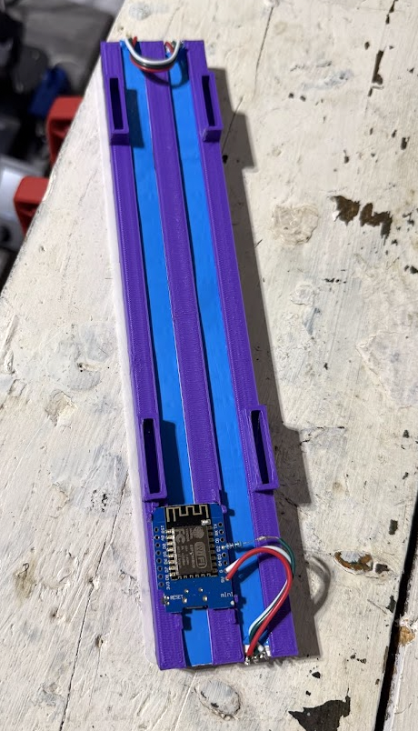
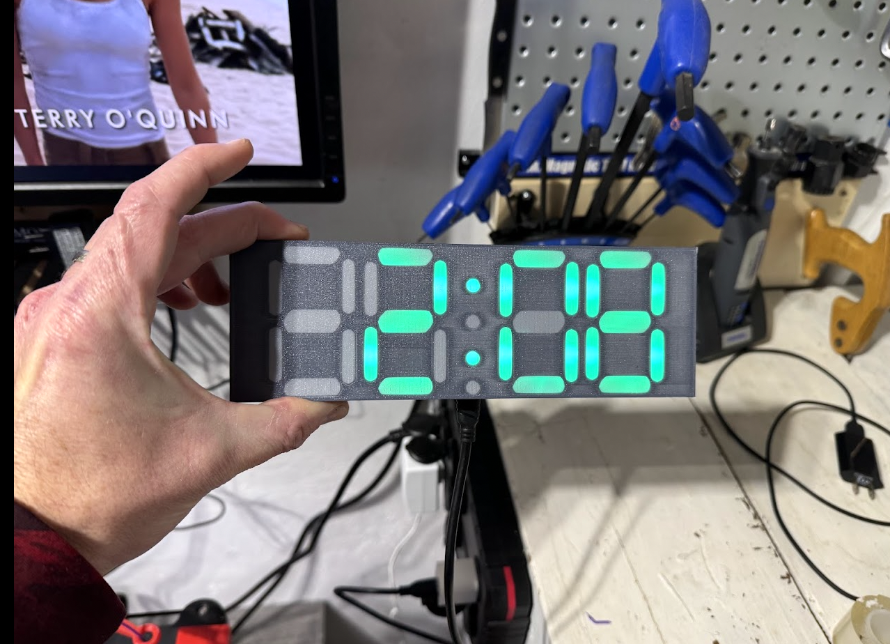
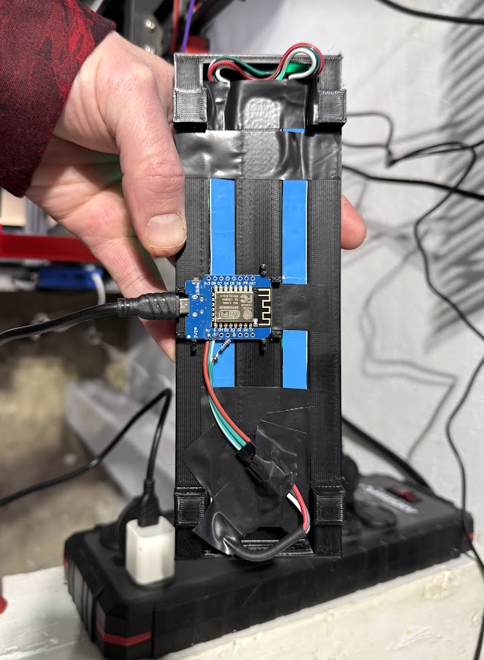
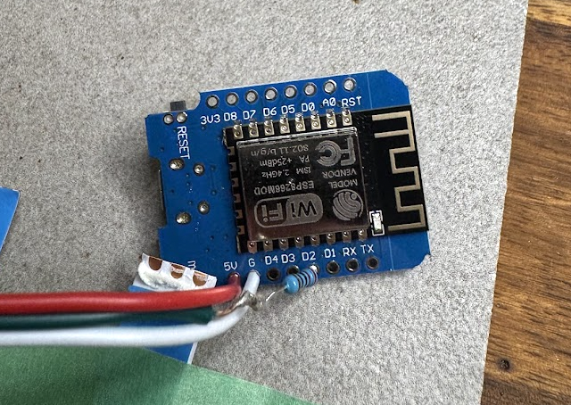

# ESP Digital Clock

A collection of 3D-printed digital clock designs powered by ESPHome and Home Assistant. This project includes both modular and monolithic clock designs that you can build according to your needs.

📦 **GitHub Repository**: [kylemath/digitalclock](https://github.com/kylemath/digitalclock)
🖨️ **Printables**: [ESP32 Seven Segment Digital Clock](https://www.printables.com/model/1101964)
🎨 **Thingiverse**: [ESP Digital Clock Collection](https://www.thingiverse.com/thing:6861353)
📺 **Video Tutorial Series**: [Four-Part Complete Build Guide](https://youtube.com/playlist?list=PLeBpq2qBuOI1kfnOv1Nu6G2_ES9P5Xj6k&si=4pqwdTxPQehg_aGT)

## Video Tutorials

### Part 1: 3D Printing & Design

- 📺 [Full Tutorial (10min)](https://youtu.be/DS_muPDX8p8)
- 🎬 [Quick Guide (2.5min)](https://youtu.be/-_kpwUeTEb4)

### Part 2: Parts, Tools, and Wiring

- 📺 [Full Tutorial (15min)](https://youtu.be/uiOuWeXdryE)
- 🎬 [Quick Guide (Coming Soon)]

### Coming Soon

- Part 3: Final Assembly
- Part 4: Firmware & Configuration

## Overview

This project provides multiple ways to build your own digital clock:

1. Modular Single Digit Design
2. 6-Digit Monolithic Clock
3. 4-Digit Monolithic Clock

## Designs

### 1. Modular Single Digit Design

Individual digit modules that can be connected together to create custom configurations.

**Features:**

- Stackable design
- Customizable arrangements
- Easy maintenance
- Individual digit control

### 2. 6-Digit Monolithic Clock

Perfect for displaying hours, minutes, and seconds (HH:MM:SS).

**Features:**

- All-in-one design
- Ideal for wall mounting
- Complete time display

### 3. 4-Digit Monolithic Clock

Available in two versions:

1. Original compact design
2. New version with integrated back lid (\_wLid)

**Features:**

- Compact size
- Perfect for desks or wall mounting
- Hour and minute display
- New \_wLid version includes:
  - Clean back design with integrated lid
  - Hidden wire management
  - Keyhole mounting slots for easy wall hanging
  - No visible screws from the front
  - Same firmware compatibility as original version
  - Improved thermal management
  - More robust construction

# ESP Digital Clock Collection

A collection of modern, customizable LED digital clock designs that integrate with Home Assistant through ESPHome. Choose between modular single digits that can be arranged however you like, or complete 4-digit and 6-digit monolithic designs.

All print files have an accompanying openSCAD .scad file which can be edited, rendered, and saved as a new .stl as you please. Super hint: Ask chatgpt for help with this.
https://openscad.org/

I got inspired after printing and building this great clock: https://www.printables.com/model/478390-ws2812b-digital-pixel-clock-esp8266-esphome-based. I wanted to make something more compact that also used strips of LEDs with minimizal soldering so used Cursor and OpenSCAD to create my own design. I tried to make it as modular as possible so that it would be easy to print and assemble.

I don't think that I saw the following design before this development, but the similarities are enough to add it as a remix. I like the great design: https://www.thingiverse.com/thing:5170654

## Design Options

1. **Modular Single Digit Design**

   - Stack and arrange digits as needed
   - Easy maintenance and replacement
   - Perfect for custom configurations
   - Individual digit control

2. **6-Digit Monolithic Clock (HH:MM:SS)**

   - All-in-one design
   - Perfect for wall mounting
   - Complete time display with seconds

3. **4-Digit Monolithic Clock (HH:MM)**
   - Compact design
   - Perfect for desks
   - Clean hour and minute display

## Required Materials

### Electronics

- ESP8266 NodeMCU or ESP32 Wemos D1 Mini
- WS2812B LED strips
- 5V Power Supply (2A minimum)
- Micro USB cable
- Dupont wires
- 220 Ohm Resistor
- Optional: Power jack connector

### Printing Details

- Main body: PLA or PETG
- Diffusers: Clear/translucent filament
- Pause Print after diffuser layers.
- No supports needed for most parts
- 0.2mm layer height recommended
- 20% infill for main bodies
- 100% infill for diffusers

# ESPHome Setup & Installation Guide

## Method 1: Home Assistant Add-on (Recommended)

If you're already using Home Assistant:

1. Open Home Assistant
2. Go to Settings → Add-ons → Add-on Store
3. Search for "ESPHome"
4. Click "Install"
5. Start the ESPHome add-on
6. Open the ESPHome dashboard

## Method 2: Command Line Installation

If you prefer using ESPHome directly:

open terminal:
`pip install esphome`

then to open the dashboard:
`esphome dashboard

## Firmware Installation

### First-Time Setup

1. Connect your ESP board to your computer via USB
2. In the firmware files, Download the appropriate YAML configuration or download the github repo, they are all called leg-digit.yaml,

2.5: You must create your own file secrets.yaml with the following

`#ESPHome
wifi_ssid: "networkName"

wifi_password: "password"

ota_password: "password"

api_encryption_key: "long_jumble_of_random_characters_you_create_once"`

ota_password is just a new key that you create that will be needed to be able to update the clock device wirelessly over the air afterwards.
api_encryption_key Is a unique BASE64 key which can be generated here:
https://esphome.io/components/api.html#configuration-variables

## Configuration Settings in led-digits.yaml

Also in addition to secrets, edit these values in your main YAML file before installing:
wifi:

> ssid: "Your_WiFi_Name"
> password: "Your_WiFi_Password"

# Installing Firmware with ESPHome Dashboard

1. Open Esphome dashboard with the yaml loaded for the print you want:
   `esphome dashboard firmwareV5_SixDigitMonolith`
2. Click the link or go to http://0.0.0.0:6052 in browser
3. Click three dots in dashboard under name of firmware > Install

## First Time Setup,

4.  plug d1 mini usb port into computer:
5.  Click Plug into this computer > Download Project > Agree to allow .bin file in browser download if needed > Open EspHome Web
6.  Connect in the new window > Find your device serialPort
7.  Click "Install"
8.  Chose File - Select the .bin file in downloads folder
9.  Click Install and it should work, you may need to reset or unplug and plug the esp32 or try a few times

## Later updates (changing colour or brightness in the code)

4. plug d1 mini into any power source and observe blue light flash
5. Click Wirelessly
6. Install should start watch log for errors and try again if needed

### Later updates Using Command Line

Navigate to your config directory
`cd path/to/config`
Compile and upload
`esphome --dashboard run ./firmwareV5_Publish6Digit/led-digit.yaml --device OTA`

## Links

- Full documentation and code: https://github.com/kylemath/digitalclock
- Detailed build instructions included in the GitHub repository

## Notes

- Basic soldering skills required
- Requires Home Assistant setup
- ESPHome knowledge helpful but not required
- Print time varies by model (2-8 hours depending on version)
- Ask chatgpt for help with any of these.

Happy printing! If you make one, please share your results!

# Building Instructions

## Wiring Instructions

## Required Materials

### Electronics

- ESP8266 NodeMCU or ESP32
- WS2812B LED strips
- 5V Power Supply (2A minimum)
- Micro USB cable
- Dupont wires
- Optional: Power jack connector

### 3D Printing

- PLA/PETG filament (recommended)
- Clear/translucent filament for diffusers

### Tools

- Soldering iron and solder
- Wire strippers
- Small screwdriver set
- Hot glue gun

## Assembly Instructions

### Modular Single Digit

1. Print required components
   - Digit housing
   - Diffuser
   - Back cover
2. Cut WS2812B strip to size
3. Solder connections
4. Install LEDs
5. Attach diffuser
6. Connect modules

### 6-Digit Monolithic

1. Print main housing
2. Print diffusers
3. Cut LED strips to size
4. Wire all segments
5. Install ESP board
6. Attach back cover

### 4-Digit Monolithic (\_wLid version)

1. Print main housing
2. Print back lid
3. Cut LED strips to size (same as original version)
4. Wire all segments
5. Install ESP board in the dedicated housing space
6. Route power cable through the side cutout
7. Attach lid using four M3 screws
8. Can be wall-mounted using the integrated keyhole slots

## Contributing

Contributions are welcome! Please feel free to submit a Pull Request.

## License

This project is licensed under the [MIT License](LICENSE).

## Acknowledgments

- Thanks to the ESPHome team
- Home Assistant community
- All contributors and testers

## Support

If you need help, please:

1. Check existing issues
2. Create a new issue
3. Join our discussion forum [link]
